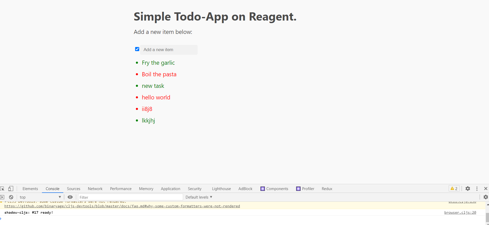

# TodoApp using Clojurescript #
### Описание
Простейшее todo-приложение на clojurescript (reagent)


### Технологии
- ClojureScript
- Reagent

### Установка
  #### Development mode
  ```
  npm install
  npx shadow-cljs watch app
  ```
  start a ClojureScript REPL
  ```
  npx shadow-cljs browser-repl
  ```
  #### Building for production

  ```
  npx shadow-cljs release app
  ```

### Дополнительно
Для работы приложения потребуется jdk, shadow-cljs.